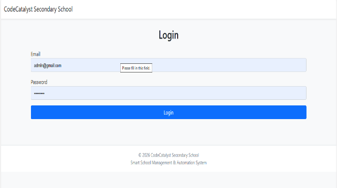
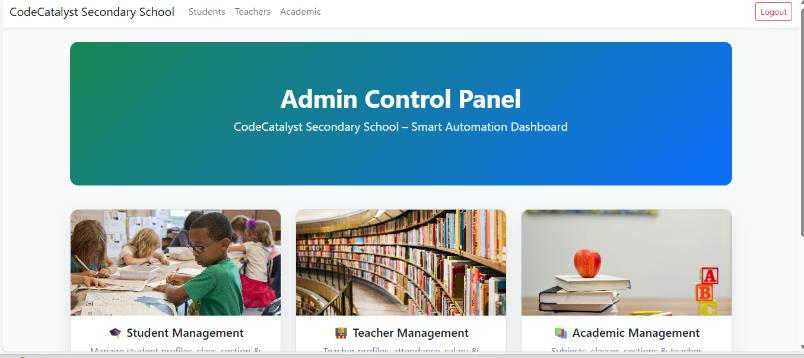
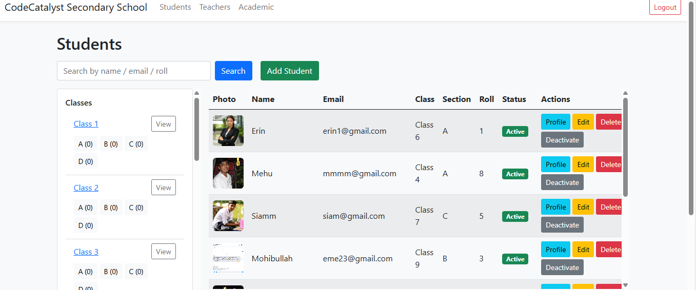
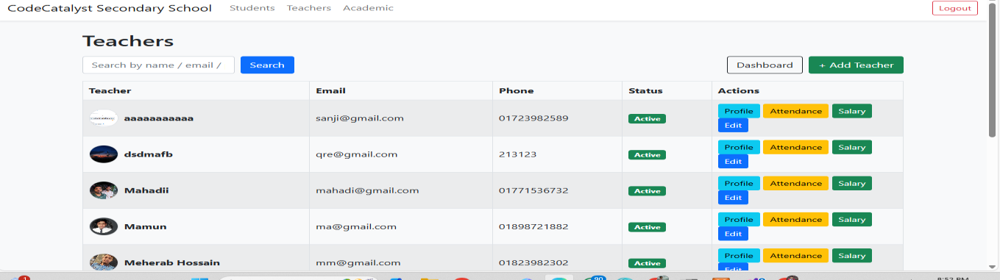
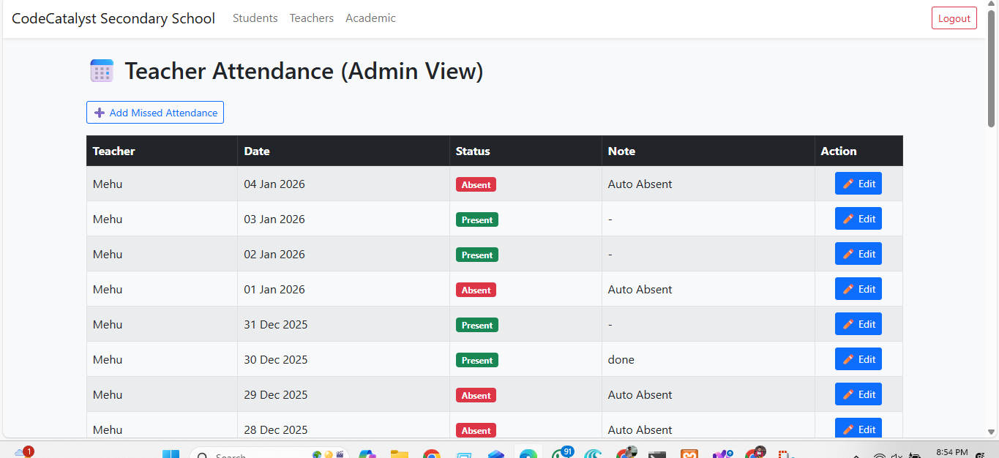
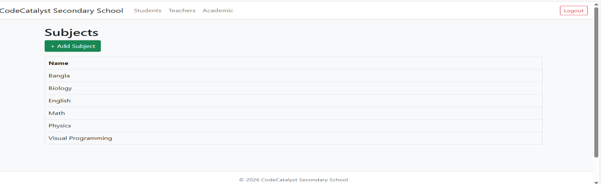

# School Management System

A full-stack **School Management System** built with ASP.NET Core MVC, Entity Framework Core, ASP.NET Core Identity, and MySQL for managing students, teachers, classes, subjects, attendance, salaries, and academic assignments.

[](https://dotnet.microsoft.com/) [](https://dotnet.microsoft.com/apps/aspnet) [](https://learn.microsoft.com/ef/core/) [](https://www.mysql.com/) [](#license)

**Live Demo:** Coming soon · **Source Code:** This repository

---

## Overview

The **School Management System** is a role-based web application developed to manage core academic and administrative activities through a centralized platform.

The system provides separate workflows for **Administrators and Teachers**, with database-driven management of students, teachers, classes, sections, subjects, attendance, salaries, enrollment history, and academic assignments.

The application follows the **ASP.NET Core MVC** architecture and uses **Entity Framework Core** with **MySQL** for data persistence.

## Features

### Admin

* Admin authentication
* Admin dashboard
* Student management
* Student profile and photo management
* Student search and filtering
* Class management
* Section management
* Parent information management
* Enrollment history
* Teacher management
* Teacher profile and photo management
* Teacher attendance management
* Teacher salary management
* Subject management
* Teacher-subject assignment
* Class and section assignment
* Academic management

### Teacher

* Teacher authentication
* Teacher dashboard
* Teacher profile
* Assigned class information
* Assigned subjects
* Attendance management
* Attendance history
* Salary information
* Password change

### Authentication & Authorization

* ASP.NET Core Identity
* Role-based authorization
* Admin and Teacher roles
* Protected controller actions
* Custom login page
* Access-denied page
* Secure authentication cookies

---

## Tech Stack

| Category           | Technology                                    |
| ------------------ | --------------------------------------------- |
| Framework          | ASP.NET Core MVC                              |
| Runtime            | .NET 8                                        |
| ORM                | Entity Framework Core 8                       |
| Authentication     | ASP.NET Core Identity                         |
| Database           | MySQL                                         |
| MySQL Provider     | Pomelo.EntityFrameworkCore.MySql              |
| Frontend           | Razor Views, HTML, CSS, Bootstrap, JavaScript |
| Database Migration | EF Core Migrations                            |
| Local Development  | Visual Studio / .NET CLI                      |

---

## System Architecture

```text
                         ┌───────────────────┐
                         │      Browser      │
                         │  Admin / Teacher  │
                         └─────────┬─────────┘
                                   │
                                   ▼
                         ┌───────────────────┐
                         │  ASP.NET Core MVC │
                         │                   │
                         │ Controllers       │
                         │ Razor Views       │
                         │ Identity          │
                         └─────────┬─────────┘
                                   │
                                   ▼
                         ┌───────────────────┐
                         │ Entity Framework  │
                         │       Core        │
                         └─────────┬─────────┘
                                   │
                                   ▼
                         ┌───────────────────┐
                         │       MySQL       │
                         │                   │
                         │ Students          │
                         │ Teachers          │
                         │ Classes           │
                         │ Subjects          │
                         │ Attendance        │
                         │ Salaries          │
                         └───────────────────┘
```

---

## Project Structure

```text
MyMvcApp/
├── Controllers/
│   ├── AcademicController.cs
│   ├── AccountController.cs
│   ├── AdminController.cs
│   ├── HomeController.cs
│   ├── StudentsController.cs
│   └── TeachersController.cs
│
├── Models/
│   ├── AppDbContext.cs
│   ├── Classroom.cs
│   ├── EnrollmentHistory.cs
│   ├── LoginViewModel.cs
│   ├── ParentInfo.cs
│   ├── Section.cs
│   ├── Student.cs
│   ├── Subject.cs
│   ├── Teacher.cs
│   ├── TeacherAttendance.cs
│   ├── TeacherDashboardRowVM.cs
│   ├── TeacherSalary.cs
│   └── TeacherSubject.cs
│
├── Views/
│   ├── Academic/
│   ├── Account/
│   ├── Admin/
│   ├── Home/
│   ├── Students/
│   ├── Teachers/
│   └── Shared/
│
├── Migrations/
│
├── wwwroot/
│   ├── css/
│   ├── js/
│   └── images/
│
├── Program.cs
├── appsettings.json
└── MyMvcApp.csproj
```

---

## Database

The application uses **MySQL** with Entity Framework Core migrations.

Database:

```text
MyMvcAppDb
```

The data model covers:

* Students
* Parents
* Classrooms
* Sections
* Enrollment history
* Teachers
* Teacher attendance
* Teacher salaries
* Subjects
* Teacher-subject assignments
* ASP.NET Core Identity users and roles

The project includes EF Core migrations for creating and updating the database schema.

---

## Run Locally

### Requirements

* .NET 8 SDK
* MySQL 8.x or compatible MySQL/MariaDB server
* Visual Studio 2022 or VS Code
* Git

### 1. Clone the repository

```bash
git clone https://github.com/YOUR_USERNAME/school-management-system.git
cd school-management-system/MyMvcApp
```

### 2. Create the database

Open MySQL or phpMyAdmin and create:

```sql
CREATE DATABASE MyMvcAppDb;
```

### 3. Configure the connection

Update the `DefaultConnection` in:

```text
appsettings.json
```

Example local configuration:

```json
{
  "ConnectionStrings": {
    "DefaultConnection": "server=localhost;port=3306;database=MyMvcAppDb;user=root;password=YOUR_PASSWORD;"
  }
}
```

Do not commit production credentials to GitHub.

### 4. Restore dependencies

```bash
dotnet restore
```

### 5. Apply migrations

```bash
dotnet ef database update
```

If Entity Framework CLI is not installed:

```bash
dotnet tool install --global dotnet-ef
```

### 6. Run the application

```bash
dotnet run
```

Open the local URL displayed by the application.

---

## Default Development Roles

The application seeds the following roles:

```text
Admin
Teacher
```

The current development configuration also creates an initial administrator account.

**Change or remove development credentials before public deployment.**

---

## Screenshots

### Login Page



### Admin Dashboard



### Student Management



### Teacher Management



### Attendance



### Subject Management



---

## Security

Before making the project publicly accessible:

* Remove or change development administrator credentials.
* Never publish production database passwords.
* Move production secrets outside `appsettings.json`.
* Remove real student, teacher, parent, or other personal information.
* Use strong production password policies.
* Restrict and validate uploaded files.
* Use HTTPS in production.
* Review role-based permissions.
* Disable detailed production error output.
* Keep dependencies updated.

---

## Future Improvements

* Student portal
* Parent portal
* Online result management
* Fee and payment management
* Examination management
* Automated email/SMS notifications
* Advanced attendance analytics
* Report generation
* Audit logs
* REST API
* Docker deployment

---

## License

This project was developed for **academic and portfolio purposes**. Add a formal open-source license if redistribution is intended.

---

<p align="center">
  Built with ASP.NET Core MVC · Entity Framework Core · MySQL
</p>
